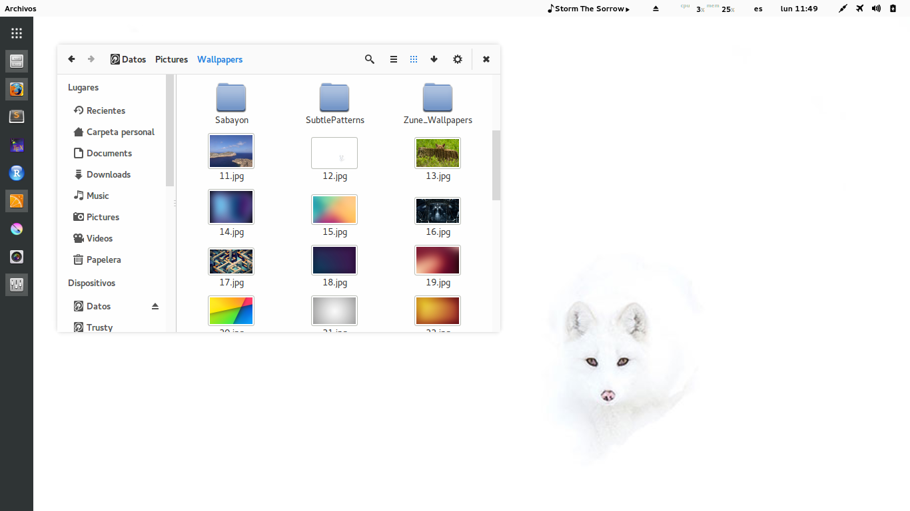

iris-light-blue
==========

A light, clean, flat and bold Gtk theme. Forked from [iris-light](http://github.com/xyl0n/iris-light) and converted the accent color into blue.

### GNOME Shell theme
The theme for GNOME shell was generated by [Elegance Colors](https://github.com/satya164/elegance-colors).

### Other colors

* [iris-light](http://github.com/xyl0n/iris-light) (red accents)
* [iris-light-green](https://github.com/chase/iris-light-green)
* [iris-light-cielo](https://github.com/rhoconlinux/iris-light-cielo/)
* [iris-dark](https://github.com/xyl0n/iris)
